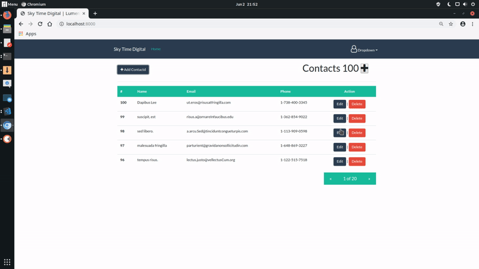

# Full CRUD Single Application API Using Vue and Lumen [Live Demo](https://github.skytimedigital.com/lumen-vue-crud/)

This is a full crud single page application ```(SPA's)```  that can be easily integrated in many web projects or mobile applications. The technologies were used to produce this application are [Lumen v5.8 stable ](https://lumen.laravel.com/) and [Vue Js v2.6.10 ](https://vuejs.org/) the Progressive JavaScript Framework. 

## Short Preview Demo


# Lumen PHP Framework

[](https://travis-ci.org/laravel/lumen-framework)
[](https://packagist.org/packages/laravel/lumen-framework)
[](https://packagist.org/packages/laravel/lumen-framework)
[](https://packagist.org/packages/laravel/lumen-framework)
[](https://packagist.org/packages/laravel/lumen-framework)

Laravel Lumen is a stunningly fast PHP micro-framework for building web applications with expressive, elegant syntax. We believe development must be an enjoyable, creative experience to be truly fulfilling. Lumen attempts to take the pain out of development by easing common tasks used in the majority of web projects, such as routing, database abstraction, queueing, and caching.

## Official Documentation

Documentation for the framework can be found on the [Lumen website](https://lumen.laravel.com/docs).

## Security Vulnerabilities

If you discover a security vulnerability within Lumen, please send an e-mail to Taylor Otwell at taylor@laravel.com. All security vulnerabilities will be promptly addressed.


# Vue Js - The Progressive JavaScript Framework
<p align="center"><a href="https://vuejs.org" target="_blank" rel="noopener noreferrer"></a></p>

<p align="center">
  <a href="https://circleci.com/gh/vuejs/vue/tree/dev"></a>
  <a href="https://codecov.io/github/vuejs/vue?branch=dev"></a>
  <a href="https://npmcharts.com/compare/vue?minimal=true"></a>
  <a href="https://www.npmjs.com/package/vue"></a>
  <a href="https://www.npmjs.com/package/vue"></a>
  <a href="https://chat.vuejs.org/"></a>
  <br>
  <a href="https://app.saucelabs.com/builds/50f8372d79f743a3b25fb6ca4851ca4c"></a>
</p>

# Getting Started
### Prerequisites

* ```PHP 7.1.3+```
* ```SQL Database```
* ```Lumen 5.8+```
* ```Vue 2.6+```


## Installing
### Download or clone

```git clone https://github.com/skytimedigital/lumen-vue-crud.git```

# 
```
cd /path/to/lumen-vue-crud
php artisan migrate
```
### Database

```
// Create database and import lumen.sql
// edit .env file
// then run
php -S localhost:8000 -t public"
```
open your favorite browser with ```http://localhost:8000/``` or use XAMPP to access the application.


# Support me
If you my work is useful to you in anyway, please consider supporting me on Patreon [Osnippet](https://www.patreon.com/osnippet)


I now spend most of my time creating  or helping to create the best content to give away free to people just like you. If I have helped you in any way whether it was a script you downloaded from one of my repository or a YouTube video you watched, please consider becoming a patron for even $1 per month. You will also have the biggest say in the direction of my content and get updates on what I am working on. 

# License

MIT License

Copyright (c) 2019 skytimedigital.com - [oSnippet](https://www.patreon.com/osnippet)

Permission is hereby granted, free of charge, to any person obtaining a copy
of this software and associated documentation files (the "Software"), to deal
in the Software without restriction, including without limitation the rights
to use, copy, modify, merge, publish, distribute, sublicense, and/or sell
copies of the Software, and to permit persons to whom the Software is
furnished to do so, subject to the following conditions:

The above copyright notice and this permission notice shall be included in all
copies or substantial portions of the Software.

THE SOFTWARE IS PROVIDED "AS IS", WITHOUT WARRANTY OF ANY KIND, EXPRESS OR
IMPLIED, INCLUDING BUT NOT LIMITED TO THE WARRANTIES OF MERCHANTABILITY,
FITNESS FOR A PARTICULAR PURPOSE AND NONINFRINGEMENT. IN NO EVENT SHALL THE
AUTHORS OR COPYRIGHT HOLDERS BE LIABLE FOR ANY CLAIM, DAMAGES OR OTHER
LIABILITY, WHETHER IN AN ACTION OF CONTRACT, TORT OR OTHERWISE, ARISING FROM,
OUT OF OR IN CONNECTION WITH THE SOFTWARE OR THE USE OR OTHER DEALINGS IN THE
SOFTWARE.